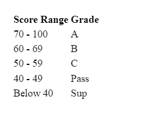
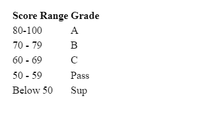
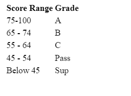

Unit Testing Assessment
The table below presents the score ranges and corresponding grades for Math, Physics, and Chemistry. 

The table below represents the score ranges and corresponding grades for Religious Education  

The table below represents the score ranges and corresponding grades for English, Swahili and Computer Studies  

Write a function called calculateGradesAndAverage that takes in an object as an input, the object is guaranteed to contain fields with valid marks and will look as shown {name: "Dennis Doe", math: 80, eng: 65, kis: 48, phy: 67, che: 56, re:89, comp: 82} where math, eng, kis, phy, che, re, comp corresponds to the student's score in Math, English, Kiswahili, Physics, Chemistry, Religious Education and Computer Studies respectively.  

The function should return an object containing the 'name' field. For each subject, the object should include a key corresponding to the subject name, with the value being the grade based on the grading tables provided above. The object should include an additional field named avgPts, which is calculated as the sum of the individual subject scores divided by 7, with the result rounded down.

Example

const studentScore = {name: "Dennis Doe", math: 80, eng: 65, kis: 48, phy: 67, che: 56, re:89, comp: 82};

const output = calculateGradesAndAverage(studentScore);

// output: {name: "Dennis Doe", math: "A", eng: "B", kis: "Pass", phy: "B", che: "C", re: "A", comp: "A", avgPts: 69};

Ensure you write tests for your program using jest. Think about how you can break down the problem into smaller problems and address each one separately.

